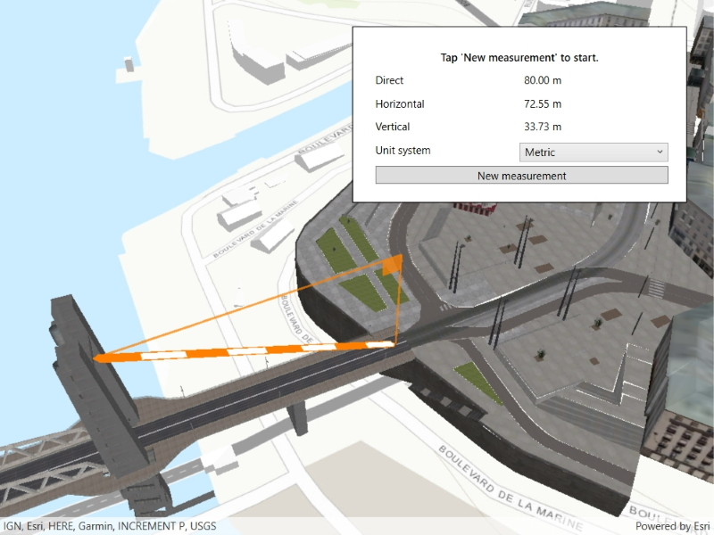

# Distance measurement analysis

This sample demonstrates measuring 3D distances between two points in a scene. The distance measurement analysis allows you to add the same measuring experience found in ArcGIS Pro, City Engine, and the ArcGIS API for JavaScript to your app. You can set the unit system of measurement (metric or imperial) and have the units automatically switch to one appropriate for the current scale. The rendering is handled internally so they do not interfere with other analyses like viewsheds.

## Instructions

Choose 'New measurement' to start a new measurement. Move the mouse to change the end location. Tap to finish the measurement. Use the dropdown to select a different unit system.
