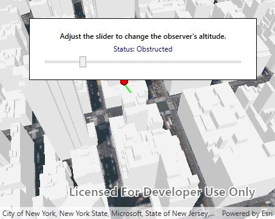

# Line of Sight (GeoElement)

This sample demonstrates how to perform a dynamic line of sight analysis between two moving GeoElements.

## Instructions

Use the slider to adjust the height of the observer.
