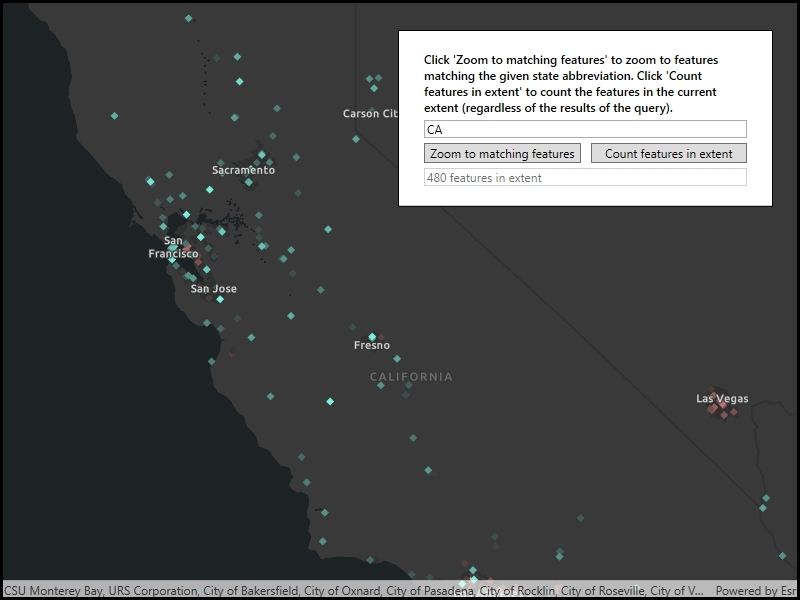

# Query feature count and extent

This sample demonstrates how to query a feature table, in this case returning a count, for features that are within the visible extent or that meet specified criteria.

## Instructions

Use the button to zoom to the extent of the state specified (by abbreviation) in the textbox or use the button to count the features in the current extent.
