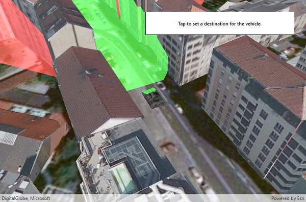

# Viewshed for GeoElement

Analyze the viewshed for an object (GeoElement) in a scene.

## Use case

A Viewshed analysis is a type of visual analysis you can perform on a scene. The viewshed aims to answer the question 'What can I see from a given location?'. The output is an overlay with two different colors - one representing the visible areas (green) and the other representing the obstructed areas (red).

## How to use the sample

Tap to set a destination for the vehicle (a GeoElement). The vehicle will 'drive' towards the tapped location. The viewshed analysis will update as the vehicle moves.

## How it works

1. Create and show the scene, with an elevation source and a buildings layer.
2. Add a model (the `GeoElement`) to represent the observer (in this case, a tank).
    * Use a `SimpleRenderer` which has a heading expression set in the `GraphicsOverlay`. This way you can relate the viewshed's heading to the `GeoElement` object's heading.
3. Create a `GeoElementViewshed` with configuration for the viewshed analysis.
4. Add the viewshed to an `AnalysisOverlay` and add the overlay to the scene.
5. Configure the SceneView `CameraController` to orbit the vehicle.

## Relevant API

* AnalysisOverlay
* GeoElementViewshed
* GeodeticDistanceResult
* GeometryEngine.DistanceGeodetic - used to animate the vehicle.
* ModelSceneSymbol
* OrbitGeoElementCameraController

## Offline data

This sample downloads the following items from ArcGIS Online automatically:

* [bradley_low_3ds.zip](https://www.arcgis.com/home/item.html?id=07d62a792ab6496d9b772a24efea45d0) - Model Scene Symbol for use in ArcGIS Runtime Samples

## About the data

This sample shows a [Johannesburg building layer](https://www.arcgis.com/home/item.html?id=eb4dab9e61b24fe2919a0e6f7905321e) from ArcGIS Online. The vehicle is a [tank](http://www.arcgis.com/home/item.html?id=07d62a792ab6496d9b772a24efea45d0).

## Tags

3D, AnalysisOverlay, GeoElementViewshed, ModelSceneSymbol, OrbitGeoElementCameraController, SceneProperties, buildings, model, scene, viewshed, visibility analysis
