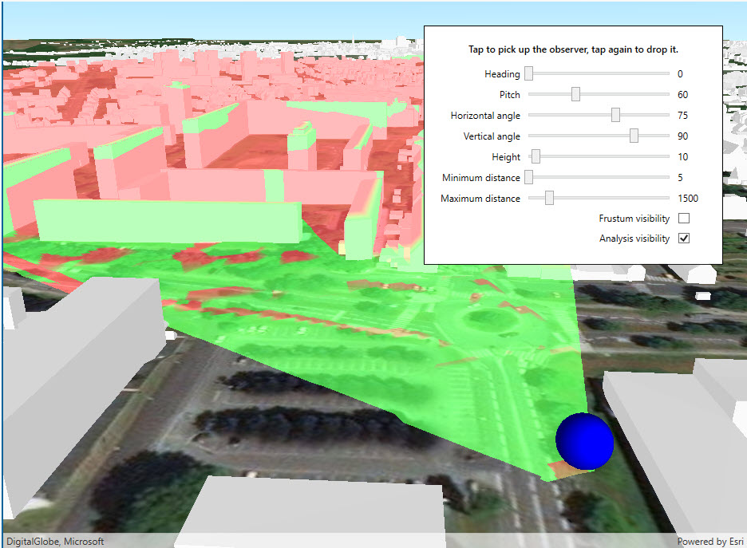

# Viewshed (Location)

This sample demonstrates the configurable properties of viewshed analysis, including frustum color, heading, pitch, distances, angles, and location.

## Instructions

Click anywhere in the scene to 'pick up' the viewshed observer location. Move the mouse to see the viewshed observer location update in real time. Click again to 'drop' the viewshed observer location.
