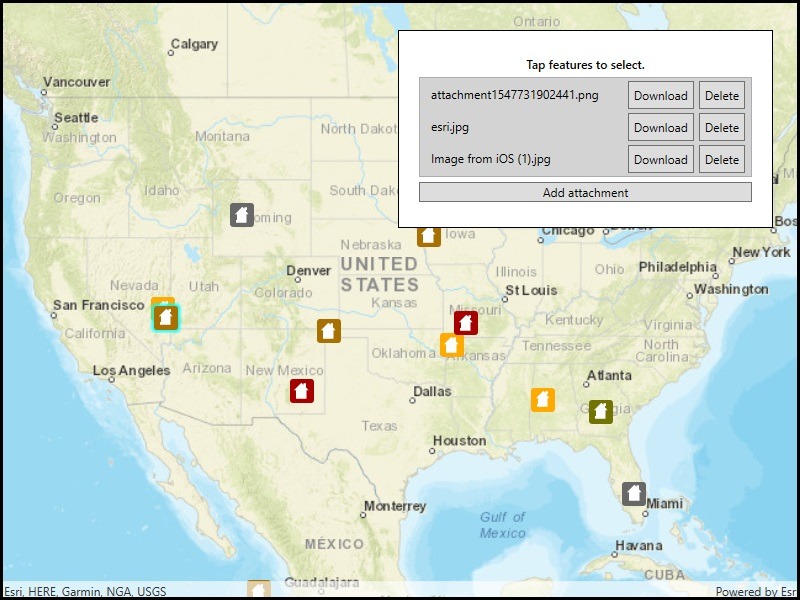

# Edit feature attachments

Add, delete, and download attachments for features from a service.

## Use case

Attachments provide a flexible way to manage additional information that is related to your features. Attachments allow you to add files to individual features, including: PDFs, text documents, or any other type of file. For example, if you have a feature representing a building, you could use attachments to add multiple photographs of the building taken from several angles, along with PDF files containing the building's deed and tax information.

## How to use the sample

Tap a feature to load its attachments. Use the buttons to save, delete, or add attachments.

## How it works

1. Create a `ServiceFeatureTable` from a URL.
2. Create a `FeatureLayer` object from the service feature table.
3. Select features from the feature layer with `FeatureLayer.SelectFeatures()`.
4. To fetch the feature's attachments, cast to an `ArcGISFeature` and use`ArcGISFeature.GetAttachmentsAsync()`.
5. To add an attachment to the selected ArcGISFeature, create an attachment and use `ArcGISFeature.AddAttachmentAsync()`.
6. To delete an attachment from the selected ArcGISFeature, use the `ArcGISFeature.DeleteAttachmentAsync()`.
7. After a change, apply the changes to the server using `ServiceFeatureTable.ApplyEditsAsync()`.

## Relevant API

* ApplyEditsAsync
* DeleteAttachmentAsync
* FeatureLayer
* FetchAttachmentsAsync
* FetchDataAsync
* ServiceFeatureTable
* UpdateFeatureAsync

## Additional information

Attachments can only be added to and accessed on service feature tables when their `HasAttachments` property is true.

## Tags

data, image, JPEG, PDF, picture, PNG, TXT
