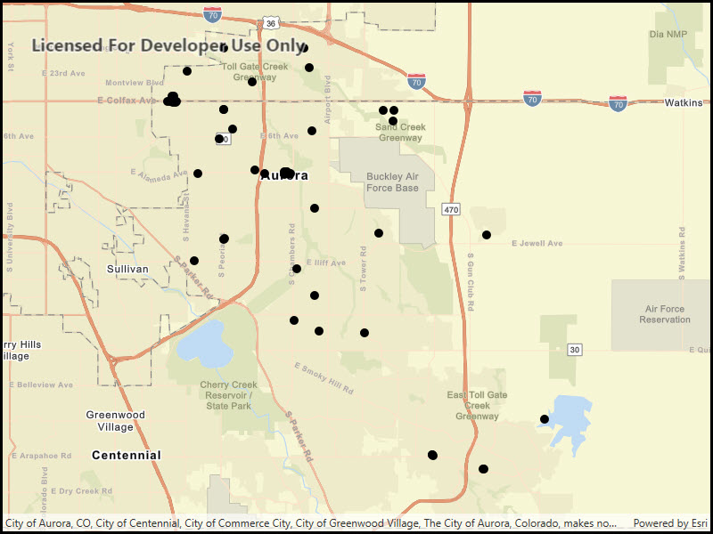

# Feature layer (shapefile)

Open a shapefile stored on the device and display it as a feature layer with default symbology.

## Use case

Shapefiles store location, shape and attributes of geospatial vector data. Shapefiles can be loaded directly into ArcGIS Runtime.

## How to use the sample

Run the app.

## How it works

1. Create a `ShapefileFeatureTable` passing in the URL of a shapefile.
2. Create a `FeatureLayer` using the shapefile feature table.
3. Add the layer to the map's operation layers.

## Relevant API

* FeatureLayer
* ShapefileFeatureTable

## Offline data

This sample downloads the following items from ArcGIS Online automatically:

* [Aurora_CO_shp.zip](https://www.arcgis.com/home/item.html?id=d98b3e5293834c5f852f13c569930caa) - Shapefiles that cover Aurora Colorado: Public art (points), Bike trails (lines), and Subdivisions (polygons).
* [Aurora_CO_shp.zip](https://www.arcgis.com/home/item.html?id=d98b3e5293834c5f852f13c569930caa) - Shapefiles that cover Aurora Colorado: Public art (points), Bike trails (lines), and Subdivisions (polygons).

## Tags

Layers, shapefile, shp, vector
