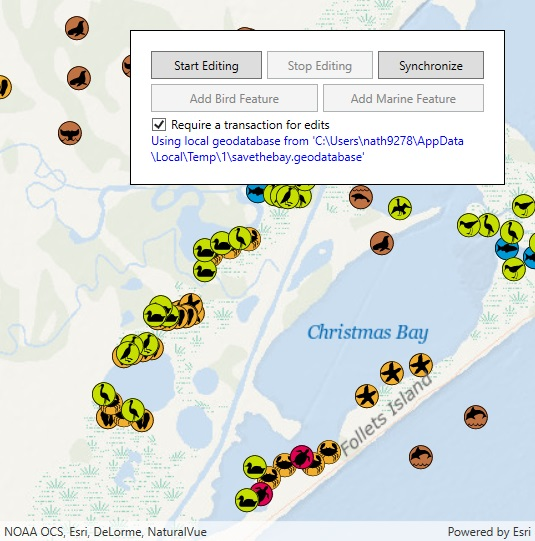

# Geodatabase transactions

This sample demonstrates how to manage edits to a local geodatabase inside of transactions.

## Instructions

When the sample loads, a local geodatabase will be generated for a small area from the 'SaveTheBay' feature service. When the geodatabase is ready, its tables are added as feature layers and the map view zooms to the extent of the local data. Use the UI controls to make edits either inside or outside of a transaction. If made in a transaction, you can rollback or commit your edits as a single unit when you choose to stop editing. To allow edits without a transaction, clear the 'Require transaction' check box. If this box isn't checked, you add features directly into the local geodatabase. When done adding features, you can synchronize your local edits with the service.
