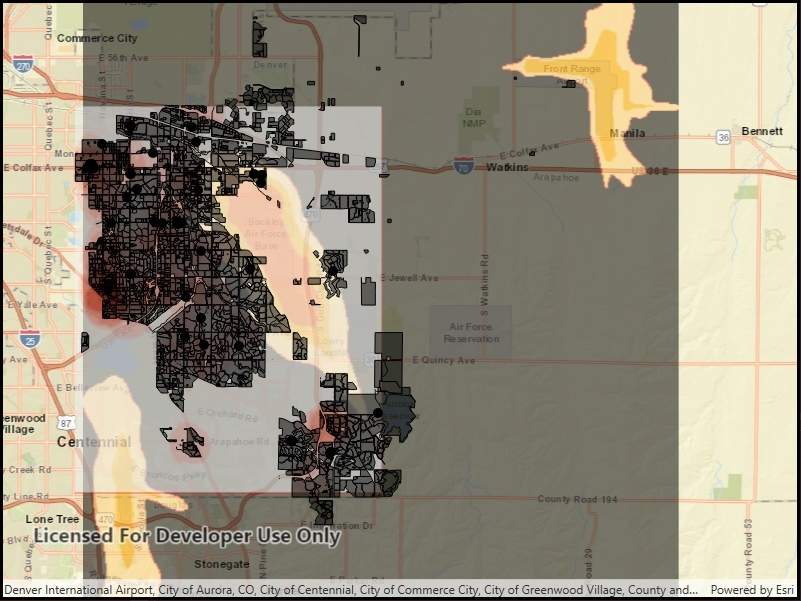

# Read GeoPackage

Add rasters and feature tables from a GeoPackage to a map.

## Use case

The OGC GeoPackage specification defines an open standard for sharing raster and vector data. You may want to use GeoPackage files to support file-based sharing of geographic data.

## How to use the sample

When the sample loads, the feature tables and rasters from the GeoPackage will be shown on the map.

## How it works

1. Open the GeoPackage using `GeoPackage.OpenAsync(path)`.
2. Iterate through available rasters exposed by `geopackage.GeoPackageRasters`.
    * For each raster, create a raster layer using `new Rasterlayer(geopackageRaster)`, then add it to the map.
3. Iterate through available feature tables, exposed by `geopackage.GeoPackageFeatureTables`.
    * For each feature table, create a feature layer using `new FeatureLayer(geopackageFeatureTable)`, then add it to the map.

## Relevant API

* GeoPackage
* GeoPackage.GeoPackageFeatureTables
* GeoPackage.GeoPackageRasters
* GeoPackageFeatureTable
* GeoPackageRaster

## Offline data

The [Aurora Colorado GeoPackage](https://www.arcgis.com/home/item.html?id=68ec42517cdd439e81b036210483e8e7) holds datasets that cover Aurora, Colorado.

## About the data

This sample features a GeoPackage with datasets that cover Aurora, Colorado: Public art (points), Bike trails (lines), Subdivisions (polygons), Airport noise (raster), and liquour license density (raster).

## Additional information

GeoPackage uses a single SQLite file (.gpkg) that conforms to the OGC GeoPackage Standard. You can create a GeoPackage file (.gpkg) from your own data using the create a SQLite Database tool in ArcGIS Pro.

## Tags

container, layer, map, OGC, package, raster, table
