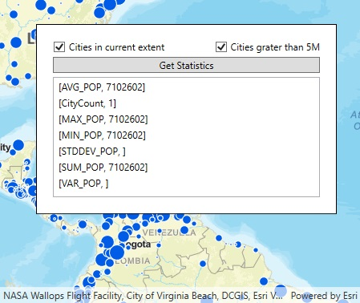

# Statistical query

This sample demonstrates how to query a feature table to get statistics for a specified field.

## Instructions

Check the appropriate boxes to filter features by attributes and/or within the current extent. Click the button to see basic statistics displayed for world cities.
