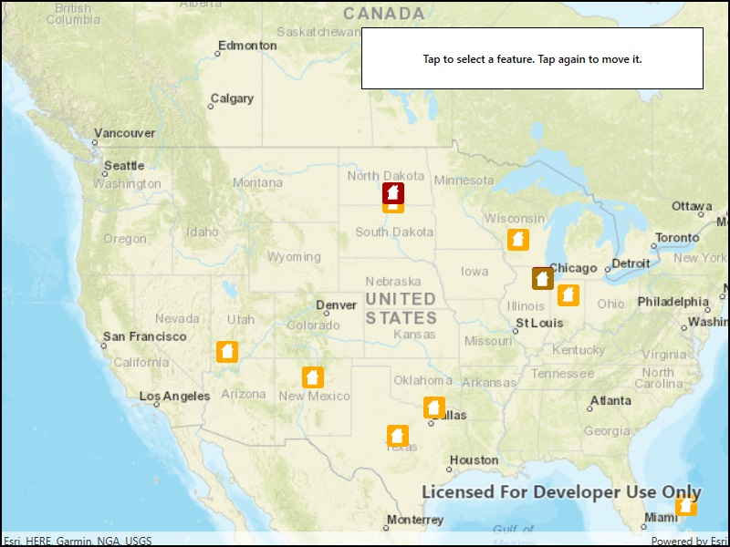

# Update geometries (feature service)

Update a feature's location in an online feature service.

## How to use the sample

Tap a feature to select it. Tap again to set the updated location for that feature. An alert will be shown confirming success or failure.

## How it works

To get a Feature from a ServiceFeatureTable and change it's geometry:

1. Create a service feature table from a URL.
2. Create a feature layer from the service feature table.
3. Select a feature from the feature layer, `FeatureLayer.SelectFeatures`.
4. Load the selected feature.
4. Change the selected feature's location using `Feature.Geometry = geometry`.
5. After the change, update the table on the server using `ServiceFeatureTable.ApplyEditsAsync()`.

## Relevant API

* Map
* Feature
* FeatureLayer
* MapView
* ServiceFeatureTable

## Tags

Service, editing, updating, moving, ServiceFeatureTable, FeatureLayer