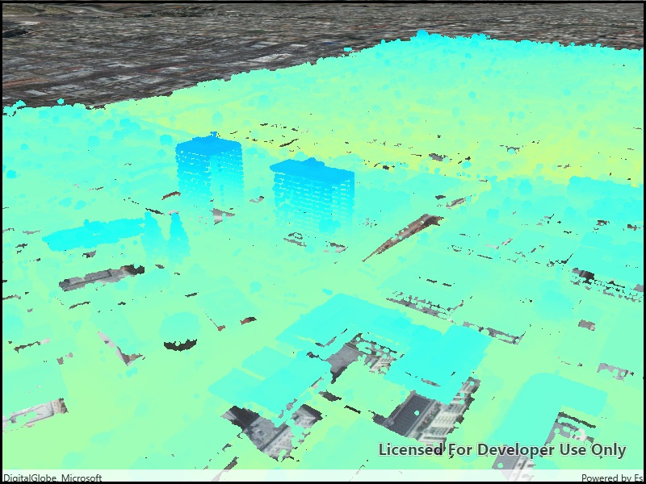

# View point cloud data offline

Display local 3D point cloud data.

## Use case  

Point clouds are often used to visualize massive sets of sensor data such as lidar. The point locations indicate where the sensor data was measured spatially, and the color or size of the points indicate the measured/derived value of the sensor reading. In the case of lidar, the color of the visualized point could be the color of the reflected light, so that the point cloud forms a true color 3D image of the area.

Point clouds can be loaded offline from scene layer packages (.slpk).

## How it works

1. Create a `PointCloudLayer` with the path to a local .slpk file containing a point cloud layer.
2. Add the layer to a scene's operational layers collection.

## Relevant API

* PointCloudLayer

## About the data

This point cloud data comes from Balboa Park in San Diego, California. Created and provided by USGS.

## Tags

3D, point cloud, lidar