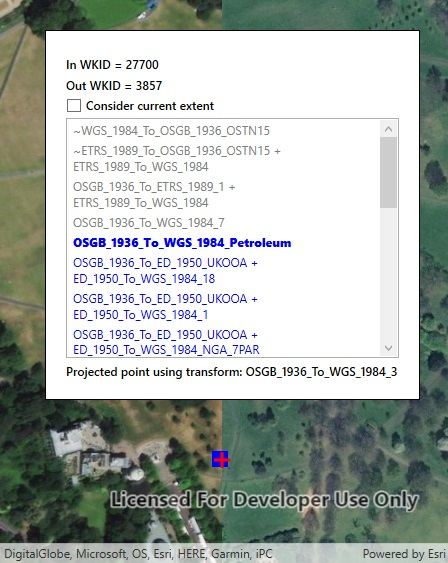

# List transformations by suitability

Get a list of suitable transformations for projecting a geometry between two spatial references with different horizontal datums.

## Use case

Transformations (sometimes known as datum or geographic transformations) are used when projecting data from one spatial reference to another when there is a difference in the underlying datum of the spatial references. Transformations can be mathematically defined by specific equations (equation-based transformations), or may rely on external supporting files (grid-based transformations). Choosing the most appropriate transformation for a situation can ensure the best possible accuracy for this operation. Some users familiar with transformations may wish to control which transformation is used in an operation.

## How to use the sample

Select a transformation from the list to see the result of projecting the point from EPSG:27700 to EPSG:3857 using that transformation. The result is shown as a red cross; you can visually compare the original blue point with the projected red cross.

Select 'Consider current extent' to limit the transformations that are appropriate for the current extent.

If the selected transformation is not usable (has missing grid files) then an error is displayed.

## How it works

1. Pass the input and output spatial references to `TransformationCatalog.GetTransformationsBySuitability` for transformations based on the map's spatial reference OR additionally provide an extent argument to only return transformations suitable to the extent. This returns a list of ranked transformations.
2. Use one of the `DatumTransformation` objects returned to project the input geometry to the output spatial reference.

## Relevant API

* DatumTransformation
* GeographicTransformation
* GeographicTransformationStep
* GeometryEngine
* GeometryEngine.Project
* TransformationCatalog

## About the data

The map starts out zoomed into the grounds of the Royal Observatory, Greenwich. The initial point is in the [EPSG:27700](https://epsg.io/27700) spatial reference, which was created by the United Kingdom Ordnance Survey. The spatial reference after projection is in the EPSG:3857 spatial reference, commonly known as web mercator.

## Additional information

Some transformations aren't available until transformation data is provided.

This sample can be used with or without provisioning projection engine data to your device. If you do not provision data, a limited number of transformations will be available.

## Tags

datum, geodesy, projection, spatial reference, transformation
