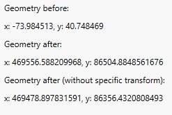

# Project with specific transformation

Project a point from one coordinate system to another using a specific transformation step.

## Use case

While the geometry engine supports automatic transformation of geometry between coordinate systems, some coordinate system pairs have specific transformations defined for additional accuracy within certain areas. For example, your organization could work in a local state plane using the NAD83 or NAD83 (HARN) datums while collecting data in the standard WGS 1984 datum. Your organization can define a specific transformation step to use to ensure precise, reliable data collection.

## How to use the sample

View the values for: unprojected point, projected with the GeometryEngine default, and projected with a specific transformation step.

## How it works

1. Get a locations coordinates in WGS 84.
2. Use the geometry engine to project the point without specifying a transformation step. Display the result for comparison.
3. Use the geometry engine to project the point, this time specifying a transformation step. Display the result.
4. Compare the results to see how a specific transformation step can result in a slightly different (and potentially more accurate) result.

## Relevant API

* GeographicTransformation
* GeographicTransformationStep

## About the data

To avoid the need to project from mercator coordinates to WGS 84, this sample uses [World Basemaps (WGS84)](https://www.arcgis.com/home/group.html?id=4c790318395940c18a16e8acd721de25) from ArcGIS Online's living atlas.

## Additional information

See [Spatial references](https://developers.arcgis.com/net/spatial-and-data-analysis/spatial-references/) in the *ArcGIS Maps SDK for .NET* guide for more information about geographic coordinate systems, geographic transformations, and projected coordinate systems.

## Tags

coordinate system, geographic, project, projection, transform, transformation, transformation step