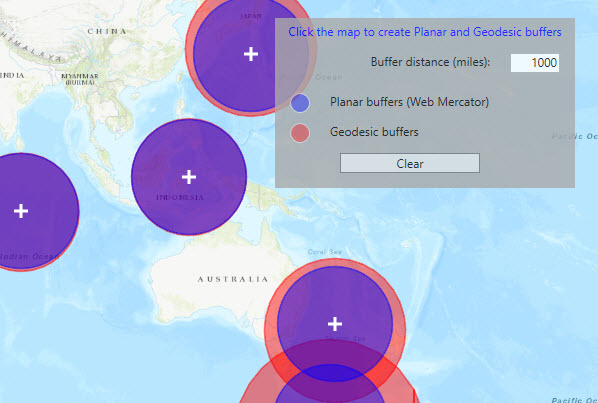

# Buffer
This sample demonstrates how to use `GeometryEngine.Buffer` to create polygons from a map location and linear distance (radius). 
For each input location, the sample creates two buffer polygons (using the same distance) and displays them on the map using different symbols. 
One polygon is calculated using the `planar` (flat) coordinate space of the map's spatial reference. The other is created using a 
`geodesic` technique that considers the curved shape of the earth's surface, and therefore provides a more accurate representation.
The difference between the buffers increases as you move away from the portion of the spatial reference that is tangental to the 
earth's surface. This map is in Web Mercator so areas near the equator are the most accurate. As you move the buffer location north
or south from that line, the buffer distortion increases. In this projection, the north and south poles become lines across the entire width 
of the top and bottom of the map. This means that the poles and the equator are all represented on the map with lines of the same length! If 
you are using planar buffers, make sure that the input locations and distance are suited to the spatial reference you're using. Remember that 
you can also create your buffers using geodesic and then project them to the spatial reference you need for display or analysis.

Creating buffers is a core concept in GIS as it allows for proximity analysis to find geographic features contained within a polygon. For example, suppose you wanted to know how many resturants are within a short walking distance of your home. The first step in this proximity analysis would be to generate a buffer polygon of a certain distance (say 1 mile) around your house.  

## Instructions

1. Tap on the map.    
2. A planar and a geodesic buffer will be created at the tap location using the distance (miles) specified in the text box.    
3. Continue tapping to create additional buffers. Notice that buffers closer to the equator are similar in size. As you move north or south from the equator, however, the geodesic polygons appear larger. Geodesic polygons are in fact a better representation of the true shape and size of the buffer. While the planar polygons appear consistent across the map, the area they represent is less accurate as you move towards the poles.    
4. The total area of planar and geodesic buffer polygons will update in the text boxes along with the percent difference between them.    
5. Click `Clear` to remove all buffers and start again.
