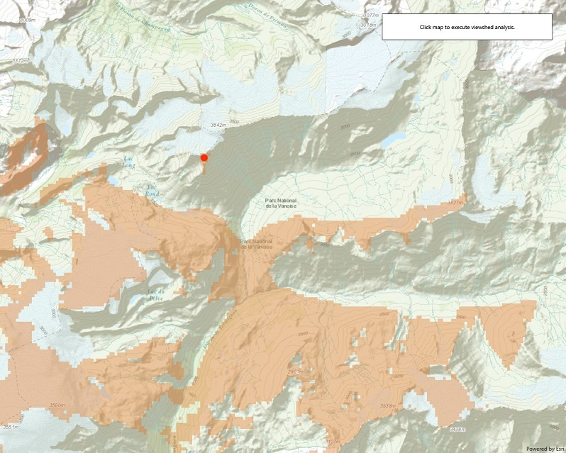

# Viewshed (Geoprocessing)

This sample demonstrates how to use GeoprocessingTask to calculate a viewshed using a geoprocessing service. Click any point on the map to see all areas that are visible within a 1 kilometer radius. It may take a few seconds for the model to run and send back the results.

