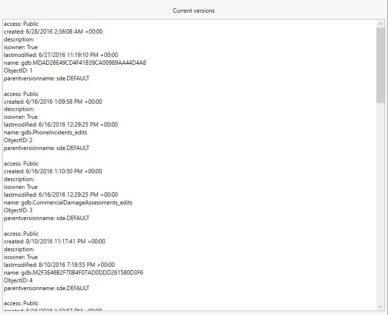

# List geodatabase versions

This sample calls a custom GeoprocessingTask to get a list of available versions for an enterprise geodatabase. The task returns a table of geodatabase version information, which is displayed in the app as a list.

