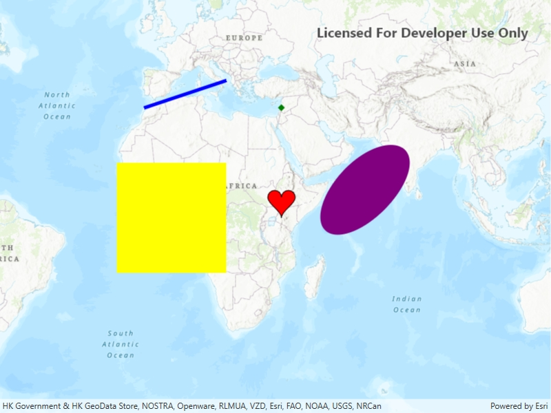

# Add graphics with renderer

A renderer allows you to change the style of all graphics in a graphics overlay by referencing a single symbol style. A renderer will only affect graphics that do not specify their own symbol style.

## Use case

A renderer allows you to change the style of all graphics in an overlay by only changing one copy of the symbol. For example, a user may wish to display a number of graphics on a map of parkland which represent trees, all sharing a common symbol.

## How to use the sample

Pan and zoom on the map to view graphics for points, lines, and polygons (including polygons with curve segments) which are stylized using renderers.

## How it works

1. Create a `GraphicsOverlay` and add it to the `MapView`.
2. Create a `Graphic`, specifying only a `Geometry`.
3. Create a single `Symbol` such as a `SimpleMarkerSymbol`.
4. Create a renderer with the `Symbol` such as new `SimpleRenderer(symbol)`.
5. Set the renderer on the `GraphicsOverlay` with `graphicsOverlay.Renderer(renderer)`.

## Relevant API

* CubicBezierSegment
* EllipticArcSegment
* GeodesicEllipseParameters
* Geometry
* Graphic
* GraphicsOverlay
* Part
* PolygonBuilder
* PolylineBuilder
* SimpleFillSymbol
* SimpleLineSymbol
* SimpleMarkerSymbol
* SimpleRenderer

## Additional information

To set unique symbols across a number of graphics (e.g. showing graphics of individual landmarks) see "Add graphics with symbols" sample.

## Tags

arc, bezier, curve, display, ellipse, graphics, marker, overlay, renderer, segment, symbol, true curve