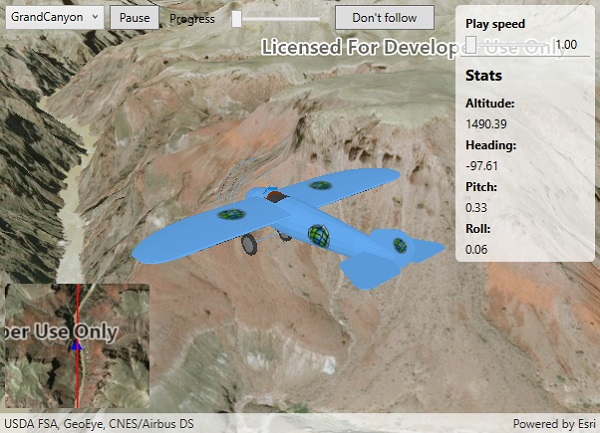

# Animate 3D graphic

An `OrbitGeoElementCameraController` follows a graphic while the graphic's position and rotation are animated.

## Use case

Visualize movement through a 3D landscape.

## How to use the sample

Animation Controls:

* Select a mission -- select a flight path
* Play/Pause -- toggles playing and stopping the animation
* Follow/Don't follow -- toggles the camera's free cam mode and follow
* Mission progress -- shows how far along the route the plane is. Slide to change keyframe in animation
* Flight speed -- controls speed of animation

## How it works

1. Create a `GraphicsOverlay` and add it to the `SceneView`.
2. Create a `ModelSceneSymbol` object.
3. Create a `Graphic` object and set its geometry to a `Point`.
4. Set the `ModelSceneSymbol` object to the graphic.
5. Add heading, pitch, and roll attributes to the graphic. Get the attributes from the graphic with `Graphic.attributes`.
6. Create a `SimpleRenderer` object and set its expression properties.
7. Add graphic and a renderer to the graphics overlay.
8. Create a `OrbitGeoElementCameraController` which is set to target the graphic.
9. Assign the camera controller to the `SceneView`.
10. Update the graphic's location, heading, pitch, and roll.

## Relevant API

* Camera
* GlobeCameraController
* Graphic
* GraphicsOverlay
* ModelSceneSymbol
* OrbitGeoElementCameraController
* Renderer
* Scene
* SceneProperties
* SceneView
* SurfacePlacement

## Offline data

This sample downloads the following items from ArcGIS Online automatically:

* [Bristol.zip](https://www.arcgis.com/home/item.html?id=681d6f7694644709a7c830ec57a2d72b) - A 3D model for use within a Model Scene Symbol
* [GrandCanyon.csv](https://www.arcgis.com/home/item.html?id=290f0c571c394461a8b58b6775d0bd63) - CSV data for a route through the Grand Canyon
* [Hawaii.csv](https://www.arcgis.com/home/item.html?id=e87c154fb9c2487f999143df5b08e9b1) - CSV data for a route in Hawaii
* [Pyrenees.csv](https://www.arcgis.com/home/item.html?id=5a9b60cee9ba41e79640a06bcdf8084d) - CSV data for a route through the Pyrenees
* [Snowdon.csv](https://www.arcgis.com/home/item.html?id=12509ffdc684437f8f2656b0129d2c13) - CSV data for a route near Mount Snowdon

## Tags

animation, camera, heading, pitch, roll, rotation, visualize
