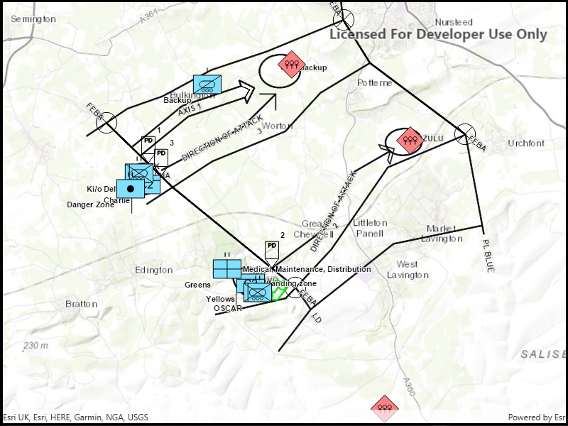

# Dictionary renderer with graphics overlay

Create graphics using a local mil2525d style file and an XML file with key/value pairs for each graphic.

## Use case

Use a dictionary renderer on a graphics overlay to display more transient data, such as military messages coming through a local tactical network.

## How it works

1. Create a new `SymbolDictionary(specificationType, dictionaryPath)`.
2. Create a new `DictionaryRenderer(symbolDictionary)`.
3. Create a new `GraphicsOverlay`
4. Set the  dictionary renderer to the graphics overlay.
5. Parse through the local XML file creating a map of key/value pairs for each block of attributes.
6. Create a `Graphic` for each attribute.
7. Use the _`wkid` key to get the geometry's spatial reference.
8. Use the `_control_points` key to get the geometry's shape.
9. Add the graphic to the graphics overlay.

## Relevant API

* DictionaryRenderer
* DictionarySymbolStyle
* GraphicsOverlay

## Tags

defense, military, situational awareness, tactical, visualization