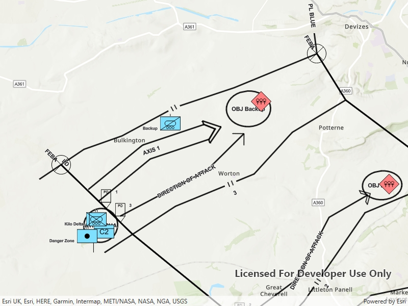

# Graphics overlay (dictionary renderer)

This sample demonstrates applying a dictionary renderer to graphics, in order to display military symbology without the need for a feature table.

## Use case

Use a dictionary renderer on a graphics overlay to display more transient data, such as military messages coming through a local tactical network.

## How to use the sample

Pan and zoom to explore military symbols on the map.

## How it works

1. Create a new `DictionarySymbolStyle(dictionaryPath)`.
2. Create a new `DictionaryRenderer(symbolDictionary)`.
3. Create a new `GraphicsOverlay`
4. Set the  dictionary renderer to the graphics overlay.
5. Parse through the XML and create a graphic for each element.
6. Use the `_wkid` key to get the geometry's spatial reference.
7. Use the `_control_points` key to get the geometry's shape.
8. Create a geometry using the shape and spatial reference from above.
9. Create a `Graphic` for each attribute, utilizing it's defined geometry.
10. Add the graphic to the graphics overlay.

## Relevant API

* DictionaryRenderer
* DictionarySymbolStyle
* GraphicsOverlay

## Offline data

This sample uses the [Mil2525d Stylx File](https://www.arcgis.com/home/item.html?id=e34835bf5ec5430da7cf16bb8c0b075c) and the [MIL-STD-2525D XML Message File](https://arcgisruntime.maps.arcgis.com/home/item.html?id=3db12175479147ea9c89ebaaf3b89996) hosted on ArcGIS Online.

## About the data

The sample opens to a view of the county Wiltshire, United Kingdom. It displays military symbols illustrating a simulated combat situation in the area.

## Tags

defense, military, situational awareness, tactical, visualization