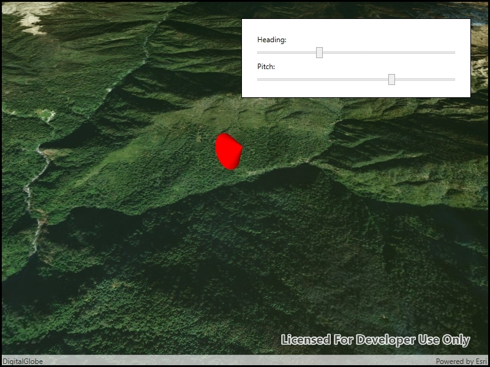

# Scene properties expressions

Update the orientation of a graphic using expressions based on its attributes.

## Use case

Instead of reading the attribute and changing the rotation on the symbol for a single graphic (a manual CPU operation), you can bind the rotation to an expression that applies to the whole overlay (an automatic GPU operation). This usually results in a noticeable performance boost (smooth rotations).

## How to use the sample

Adjust the heading and pitch sliders to rotate the cone.

## How it works

1. Create a new graphics overlay.
2. Create a simple renderer and set its scene properties.
3. Set the heading expression to `[HEADING]`.
4. Apply the renderer to the graphics overlay.
5. Create a graphic and add it to the overlay.
6. To update the graphic's rotation, update the  **HEADING** or **PITCH** property in the graphic's attributes.

## Relevant API

* Graphic.Attributes
* GraphicsOverlay
* SceneProperties
* SceneProperties.HeadingExpression
* SceneProperties.PitchExpression
* SimpleRenderer
* SimpleRenderer.SceneProperties

## Tags

3D, expression, graphics, heading, pitch, rotation, scene, symbology