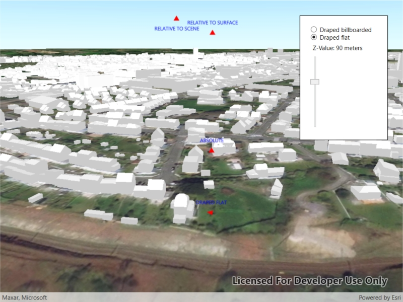

# Surface placement

Position graphics relative to a surface using different surface placement modes.

## Use case

Depending on the use case, data might be displayed at a consistent, absolute height (e.g. flight data recorded relative to sea level), at a relative height to the terrain (e.g. transmission lines positioned relative to the ground), or draped directly onto the terrain (e.g. location markers, area boundaries).

## How it works

1. Create a `GraphicsOverlay` for each placement mode, setting `SceneProperties.SurfacePlacement`:
    * `Draped`, Z value of graphic has no affect and graphic is attached to surface
    * `Relative`, position graphic using its Z value plus the elevation of the surface
    * `Absolute`, position graphic using only its Z value
2. Add graphics to the graphics overlay, `GraphicsOverlay.Graphics.Add(Graphic)`.
3. Add each graphics overlay to the scene view by calling `SceneView.GraphicsOverlays.Add(overlay)`.

## Relevant API

* Graphic
* GraphicsOverlay
* LayerSceneProperties.SurfacePlacement
* SceneProperties
* Surface

## About the data

The scene launches with a view of northern Snowdonia National Park. Three points are shown hovering with positions defined by each of the different surface placement modes.

## Additional information

This sample uses an elevation service to add elevation/terrain to the scene. Graphics are positioned relative to that surface for the `Draped` and `Relative` surface placement modes.

## Tags

3D, altitude, draped, floating, scenes, sea level, surface placement
