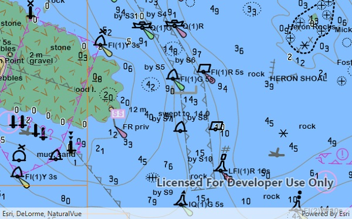

# Add ENC exchange set

Display nautical charts per the ENC specification.

## Use case

The [ENC specification]( https://www.iho.int/iho_pubs/standard/S-57Ed3.1/20ApB1.pdf) describes how hydrographic data should be displayed digitally.

An ENC exchange set is a catalog of data files which can be loaded as cells. The cells contain information on how symbols should be displayed in relation to one another, so as to represent information such as depth and obstacles accurately.

## How it works

1. Specify the path to a local CATALOG.031 file to create an `EncExchangeSet`.
2. After loading the exchange set, get the `EncDataset` objects in the exchange set`.
3. Create an `EncCell` for each dataset. Then create an `EncLayer` for each cell.
4. Add the ENC layer to a map's operational layers collection to display it.

## Relevant API

* EncCell
* EncDataset
* EncExchangeSet
* EncLayer

## Offline data

This sample downloads the following items from ArcGIS Online automatically:

* [ExchangeSetwithoutUpdates.zip](https://www.arcgis.com/home/item.html?id=9d2987a825c646468b3ce7512fb76e2d) - Fake ENC content for use in ArcGIS Runtime samples.

## Tags

Data, ENC, hydrographic, layers, maritime, nautical chart
