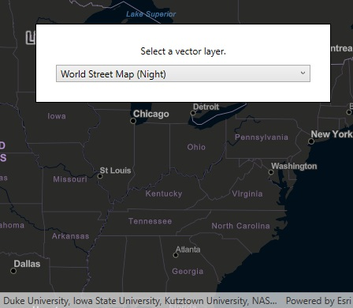

# ArcGIS vector tiled layer URL

Load an ArcGIS Vector Tiled Layer from a URL.

## Use case

Vector tile basemaps can be created in ArcGIS Pro and published as offline packages or online services. `ArcGISVectorTiledLayer` has many advantages over traditional raster based basemaps (`ArcGISTiledLayer`), including smooth scaling between different screen DPIs, smaller package sizes, and the ability to rotate symbols and labels dynamically.

## How to use the sample

Use the drop down menu to load different vector tile basemaps.

## How it works

1. An `ArcGISVectorTiledLayer` is constructed with an ArcGIS Online service URL
2. The layer instance is added to the `Map`

## Relevant API

* ArcGISVectorTiledLayer
* Basemap

## Tags

tiles, vector, vector basemap, vector tiled layer, vector tiles