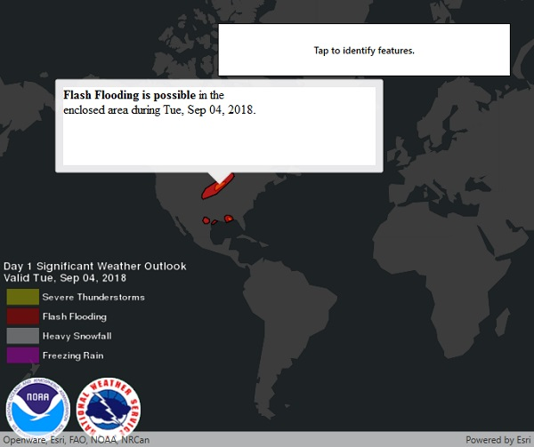

# Identify KML features

This sample demonstrates how to identify features in a KML layer. Identified feature attributes are displayed in a callout to simulate a popup.

## How to use the sample

Click or tap a feature to identify it. Feature information will be displayed in a popup. 

Note: the KML layer used in this sample contains a screen overlay. The screen overlay contains a legend and the logos for NOAA and the NWS. You can't identify the screen overlay.

## Relevant API

* `KmlLayer`
* `KmlPlacemark`
* `KmlPlacemark.BalloonContent`
* `IdentifyLayerResult`

## About the map

This sample shows a forecast for significant weather within the U.S. Regions of severe thunderstorms, flooding, snowfall, and freezing rain are shown. Tap the features to see details.

## Tags

Weather, NOAA, NWS, KML, OGC