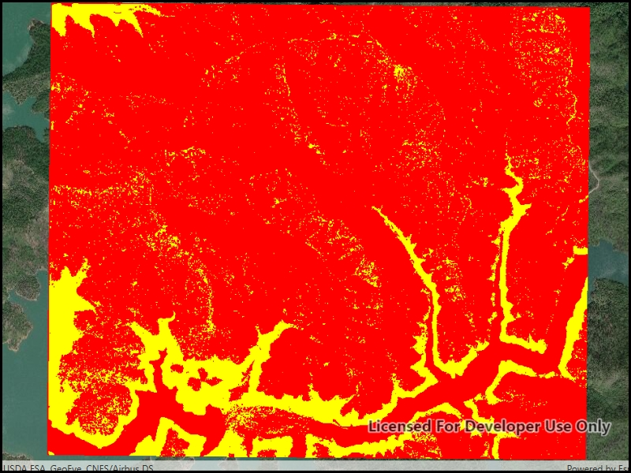

# Colormap renderer

Apply a colormap renderer to a raster.

## Use case

A colormap renderer transforms pixel values in a raster to display raster data based on specific colors, aiding in visual analysis of the data. For example, a forestry commission may want to quickly visualize areas above and below the tree-line line occurring at a know elevation on a raster containing elevation values. They could overlay a transparent colormap set to color those areas below the tree-line elevation green, and those above white.

## How to use the sample

Pan and zoom to explore the effect of the colormap applied to the raster.

## How it works

To apply a `ColormapRenderer` to a `RasterLayer`:

1. Create a `Raster` from a raster file.
2. Create a `RasterLayer` from the raster.
3. Create an `IEnumerable<Color>` representing colors. Colors at the beginning of the list replace the darkest values in the raster and colors at the end of the list replaced the brightest values of the raster.
4. Create a `ColormapRenderer` with the color list: `ColormapRenderer(colors)`, and apply it to the raster layer with `rasterLayer.Renderer = colormapRenderer`.

## Relevant API

* Basemap
* ColormapRenderer
* Map
* MapView
* Raster
* RasterLayer

## Offline data

[ShastaBW.tif raster](https://www.arcgis.com/home/item.html?id=cc68728b5904403ba637e1f1cd2995ae)

## About the data

The raster used in this sample shows an area in the south of the Shasta-Trinity National Forest, California.

## Tags

colormap, data, raster, renderer, visualization
