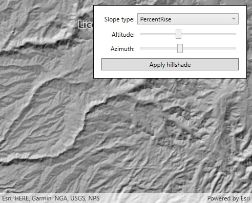

# Raster hillshade renderer

This sample demonstrates how to use a hillshade renderer on a raster layer. Hillshade renderers can adjust a grayscale raster (usually of terrain) according to a hypothetical sun position (azimuth and altitude).

