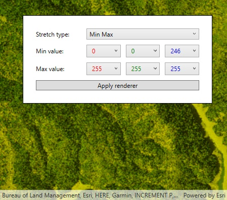

# RGB Renderer

Use an `RGBRenderer` on a `RasterLayer`. An `RGBRenderer` is used to adjust the color bands of a multispectral image.

## How to use the sample

Configure the options for rendering, then click 'Apply hillshade'.

## How it works

1. Create a `Raster` from a from a multispectral raster file.
2. Create a `RasterLayer` from the `Raster`.
3. Create a `Basemap` from the `RasterLayer` and set it to the map.
4. Create a `RGBRenderer`, specifying the stretch parameters and other properties.
5. Apply the renderer to the raster layer.

## Relevant API

* Map
* Basemap
* MapView
* RGBRenderer
* Raster
* RasterLayer
* StretchParameters

## Offline data

This sample downloads the following items from ArcGIS Online automatically:

* [raster-file.zip](https://www.arcgis.com/home/item.html?id=7c4c679ab06a4df19dc497f577f111bd) - Tif raster file

## Tags

RGB, Visualization, analysis, bands, imagery, multispectral, raster, renderer
