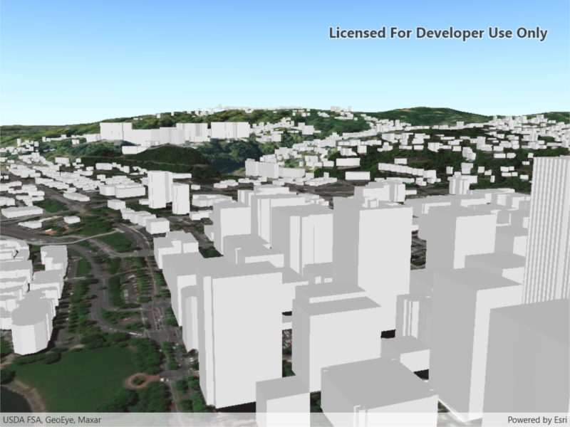

# ArcGIS Scene layer (URL)
Display an ArcGIS scene layer from a URL.

## How to use the sample
Pan and zoom to explore the scene.

## How it works
1. Create an `ArcGISSceneLayer` passing in the URL to a scene layer service.
2. Use `sceneView.setOnTouchListener` to get the screen tap location `screenPoint`.
3. Call `sceneView.identifyLayersAsync(sceneLayer, screenPoint, tolerance, false, 1)` to identify features in the scene.
4. From the resulting `IdentifyLayerResult`, get the list of identified `GeoElements` with `result.getElements()`.
5. Get the first element in the list, checking that it is a feature, and call `sceneLayer.selectFeature(feature)` to select it.

## About the data

This sample shows a [Geneva buildings scene layer](https://www.arcgis.com/home/item.html?id=033ecf268ae34489ac9aa1e88cd70860) from ArcGIS Online.

## Relevant API
* `Scene`
* `ArcGISSceneLayer`
* `SceneView`

## Tags
Buildings, multipatch, scene, model, 3D