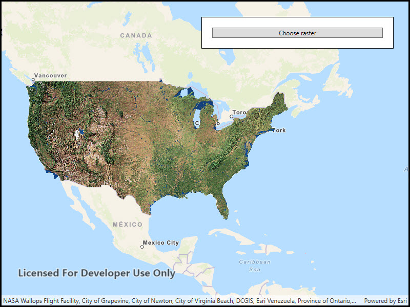

# Local server dynamic workspace raster

Dynamically add a local raster file to a map using Local Server.

## Use case

For executing offline geoprocessing tasks in your ArcGIS Runtime apps via an offline (local) server.

## How to use the sample

A Local Server and Local Feature Service will automatically be started and once running a Feature Layer will be created and added to the map.

## Relevant API

* ArcGISMapImageLayer
* ArcGISMapImageSublayer
* DynamicWorkspace
* LocalServer
* RasterSublayerSource
* RasterWorkspace
* StatusChangedEvent

## Offline data

This sample downloads the following items from ArcGIS Online automatically:

* [mpk_blank.mpk](https://www.arcgis.com/home/item.html?id=ea619b4f0f8f4d108c5b87e90c1b5be0) - Blank MPK for use of Dynamic Workspaces with ArcGIS Runtime Local Server SDK.
* [usa_raster.zip](https://www.arcgis.com/home/item.html?id=80b43ba48f524a8eb0cb54f0f1ee9a5f) - Land use land cover raster data for the USA.

## Additional information

Local Server can be downloaded for Windows and Linux platforms. Local Server is not supported on macOS.

## Tags

ArcGISMapImageLayer, LocalMapService, local services
