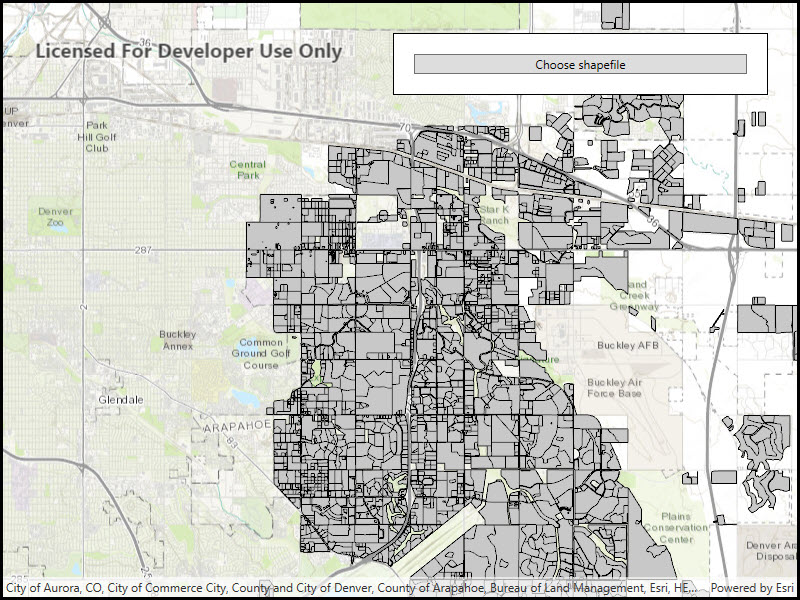

# Local server dynamic workspace shapefile

Dynamically add a local shapefile to a map using Local Server.

## Use case

For executing offline geoprocessing tasks in your ArcGIS Runtime apps via an offline (local) server.

## How to use the sample

A Local Server will automatically start once application is running.
Select a shapefile using the `Choose Shapefile` button which will automatically start a
Local Map Service where a Dynamic Shapefile Workspace will be set and displayed to the Map View.

## Relevant API

* ArcGISMapImageLayer
* ArcGISMapImageSublayer
* DynamicWorkspace
* LocalServer
* ShapefileWorkspace
* TableSublayerSource

## Offline data

This sample downloads the following items from ArcGIS Online automatically:

* [mpk_blank.mpk](https://www.arcgis.com/home/item.html?id=ea619b4f0f8f4d108c5b87e90c1b5be0) - Blank MPK for use of Dynamic Workspaces with ArcGIS Runtime Local Server SDK.
* [mjrroads.zip](https://www.arcgis.com/home/item.html?id=c6183a41b91d4cea80717d9dba831649) - Major roads in eastern Canada.

## Additional information

Local Server can be downloaded for Windows and Linux platforms. Local Server is not supported on macOS.

## Tags

ArcGISMapImageLayer, LocalMapService, local services
