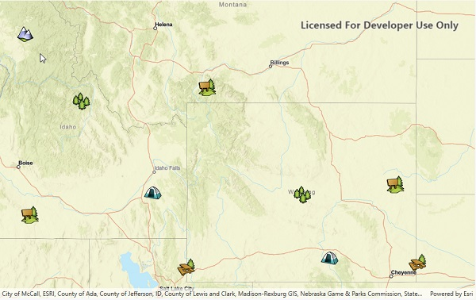

# Local server feature layer

Start a local feature service and display its features in a map.

## Use case

For executing offline geoprocessing tasks in your ArcGIS Runtime apps via an offline (local) server.

## How to use the sample

A Local Server and Local Feature Service will automatically be started. Once started then a `FeatureLayer` will be created and added to the map.

## Relevant API

* FeatureLayer
* LocalFeatureService
* LocalServer
* LocalServerStatus
* StatusChangedEvent

## Offline data

This sample downloads the following items from ArcGIS Online automatically:

* [PointsofInterest.mpk](https://www.arcgis.com/home/item.html?id=4e94fec734434d1288e6ebe36c3c461f) - This map package is included in the ArcGIS Runtime sample data.

## Additional information

Local Server can be downloaded for Windows and Linux platforms. Local Server is not supported on macOS.

## Tags

LocalFeatureService, LocalServerStatus, local services
