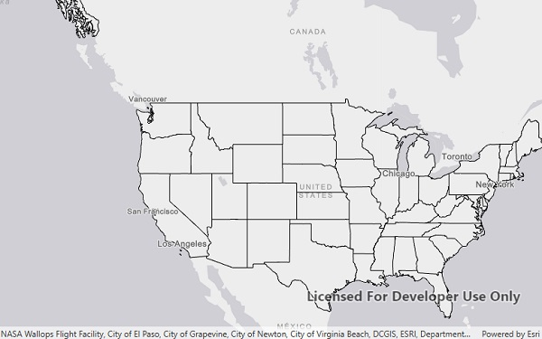

# Local Server map image layer

Start the Local Server and Local Map Service, create an ArcGIS Map Image Layer from the Local Map Service, and add it to a map.

## Use case

For executing offline geoprocessing tasks in your ArcGIS Runtime apps via an offline (local) server.

## How to use the sample

The Local Server and local map service will automatically be started and, once running, a map image layer will be created and added to the map.

## Relevant API

* ArcGISMapImageLayer
* LocalMapService
* LocalServer
* LocalServerStatus

## Offline data

This sample downloads the following items from ArcGIS Online automatically:

* [RelationshipID.mpk](https://www.arcgis.com/home/item.html?id=dee5d8060a6048a4b063484199a9546b) - This map package is included in the ArcGIS Runtime sample data.

## Additional information

Local Server can be downloaded for Windows and Linux platforms. Local Server is not supported on macOS.

## Tags

ArcGISMapImageLayer, LocalMapService, local services
