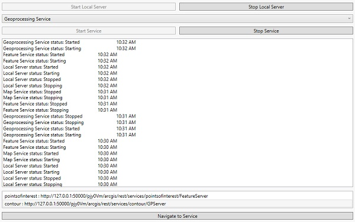

# Local server services

Demonstrates how to start and stop the Local Server and start and stop a local map, feature, and geoprocessing service running on the Local Server.

## Use case

For executing offline geoprocessing tasks in your ArcGIS Runtime apps via an offline (local) server.

## How to use the sample

Click `Start Local Server` to start the Local Server. Click `Stop Local Server` to stop the Local Server.

The `Map Service` combo box lets you to pick a local service that is available.

After browsing for the desired file, click `Start Service` to start the selected service.

When the running service's url appears, select it and click `Open Url`. To stop this running service, click `Stop Service`.

## Relevant API

* LocalFeatureService
* LocalGeoprocessingService
* LocalMapService
* LocalServer
* LocalServerStatus
* LocalService

## Additional information

Local Server can be downloaded for Windows and Linux platforms. Local Server is not supported on macOS.

## Tags

LocalFeatureService, LocalGeoprocessingService, LocalMapService, LocalServer.Instance.StatusChanged, local services
