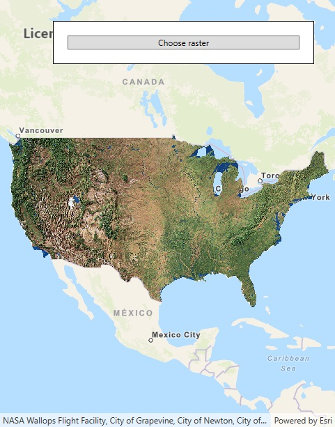

# Dynamic workspace Raster

This sample demonstrates how to dynamically add a local Raster to a map using Local Server.

## Instructions

This sample depends on the local server being installed and configured. See https://developers.arcgis.com/net/latest/wpf/guide/local-server.htm for details and instructions.
Click on the 'Choose Raster' button to select a Raster. The file picker will start in the sample viewer's offline data directory. Sample Rasters are loaded in the background. 
