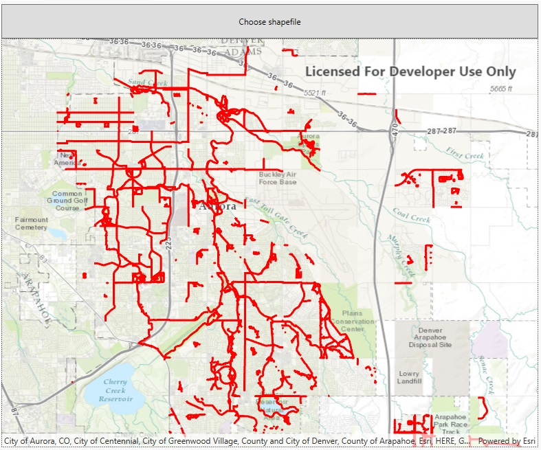

# Dynamic workspace shapefile

This sample demonstrates how to dynamically add a local shapefile to a map using Local Server.

## Instructions

This sample depends on the local server being installed and configured. See https://developers.arcgis.com/net/latest/wpf/guide/local-server.htm for details and instructions.
Click on the 'Choose Shapefile' button to select a shapefile. The file picker will start in the sample viewer's offline data directory. Sample shapefiles are loaded in the background. 
