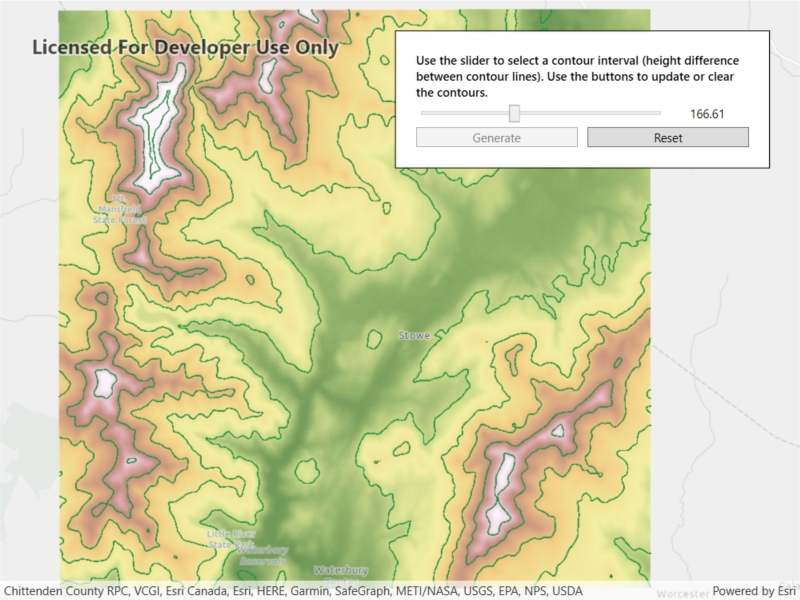

# Local Server Geoprocessing

This sample demonstrates how to perform geoprocessing tasks using Local Server.

## Instructions

This sample depends on the local server being installed and configured. See https://developers.arcgis.com/net/latest/wpf/guide/local-server.htm for details and instructions.
Sample data is loaded in the background.
Note that the functionality used by this sample requires that Geoprocessing packages be enabled in the ArcGISLocalServer.AGSDeployment file that is included in your project. See [Create a Local Server deployment](https://developers.arcgis.com/net/latest/wpf/guide/create-a-local-server-deployment.htm) for more information.
