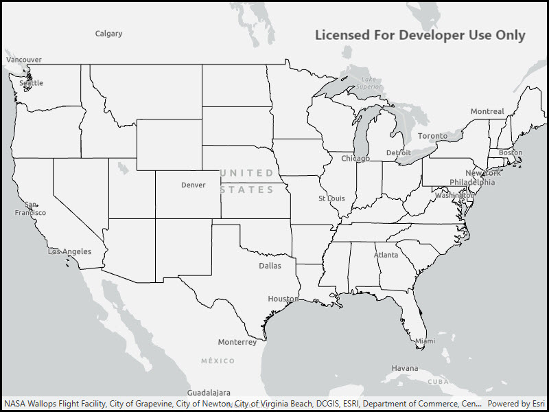

# Local Server Map Image Layer

This sample demonstrates how to display a Map Image Layer from a local map service

## Instructions

This sample depends on the local server being installed and configured. See https://developers.arcgis.com/net/latest/wpf/guide/local-server.htm for details and instructions.
Sample data is loaded in the background. 
