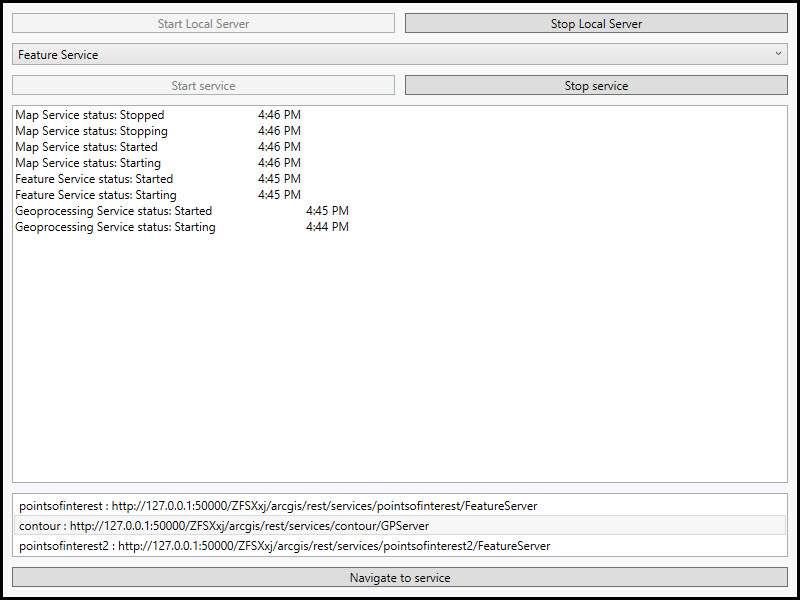

# Local Server Services

This sample demonstrates how to control local server and manage running services.

## Instructions

This sample depends on the local server being installed and configured. See https://developers.arcgis.com/net/latest/wpf/guide/local-server.htm for details and instructions. 
 Sample data is downloaded automatically once local server is started. It may take some time for sample data to load. The list of services will be enabled once the download has finished.
