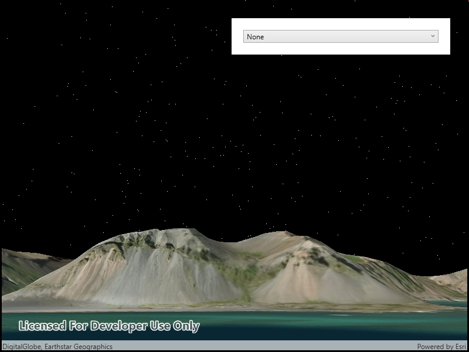

# Change atmosphere effect

Changes the appearance of the atmosphere in a scene.

## How to use the sample

Select one of the three available atmosphere effects. The sky will change to display the selected atmosphere effect. 

## How it works

To change the atmosphere effect:

1. Create a scene and display it in a scene view.
2. Change the atmosphere effect with the `SceneView.AtmosphereEffect` property.
 
## Relevant API

* SceneView
* SceneView.AtmosphereEffect

## Additional Information

There are three atmosphere effect options:

- **Realistic** - Atmosphere effect applied to both the sky and the surface as viewed from above. 
- **Horizon only** - Atmosphere effect applied to the sky (horizon) only.
- **None** - No atmosphere effect. The sky is rendered black with a starfield consisting of randomly placed white dots.

## Tags

3D, AtmosphereEffect, Scene