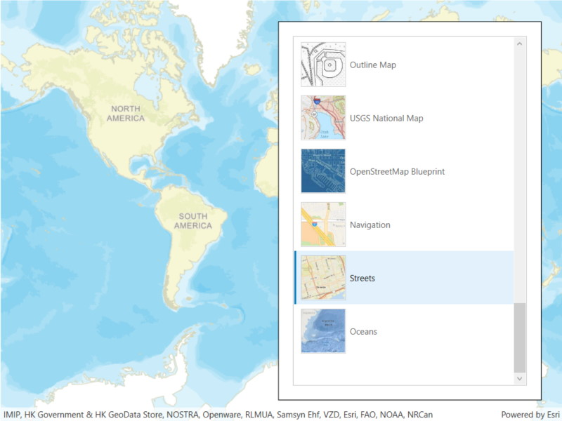

# Change basemap

Change a map's basemap. A basemap is beneath all layers on a `Map` and is used to provide visual reference for the operational layers.

## Use case

Basemaps should be selected contextually. For example, in maritime applications, it would be more appropriate to use a basemap of the world's oceans as opposed to a basemap of the world's streets.

## How to use the sample

When the basemap gallery appears, select a basemap to be displayed.

## How it works

1. Create an `Map` object.
2. Set the map to the `MapView` object.
3. Create a `BasemapGallery` using the toolkit. 
4. Use the `BasemapSelected` event to change the basemap. 

## Relevant API

* Basemap
* BasemapGallery
* Map
* MapView

## Tags

basemap, map