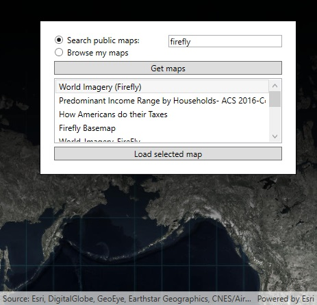

# Search a portal for maps

This sample demonstrates searching a portal for web maps and loading them in the map view. You can search ArcGIS Online public web maps using tag values or browse the web maps in your account. OAuth is used to authenticate with ArcGIS Online to access items in your account.

## Instructions

1. When the sample starts, you will be presented with a dialog for entering OAuth settings. If you need to create your own settings, sign in with your developer account and use the [ArcGIS for Developers dashboard](https://developers.arcgis.com/dashboard) to create an Application to store these settings.
2. Enter values for the following OAuth settings.
	1. **Client ID**: a unique alphanumeric string identifier for your application
	2. **Redirect URL**: a URL to which a successful OAuth login response will be sent
3. If you do not enter OAuth settings, you will be able to search public web maps on ArcGIS Online. Browsing the web map items in your ArcGIS Online account will be disabled, however.
