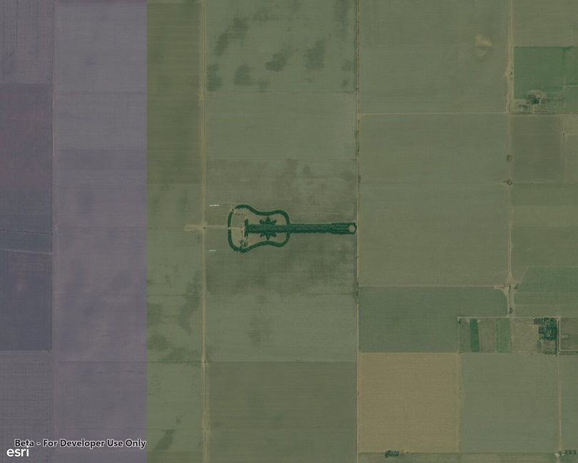

# Set initial map location

Display a map centered on an initial point with a specified level of detail (zoom level).

## How it works

1. Create a `Map`, specifying a basemap type, latitude and longitude in WGS84, and a level of detail.
2. Display the map in a map view.

## Relevant API

* BasemapType
* Map
* MapView

## About the data

The map opens with satellite imagery of a guitar-shaped field in the Pampas region of north central Argentina.

## Tags

center, envelope, extent, initial location, level of detail