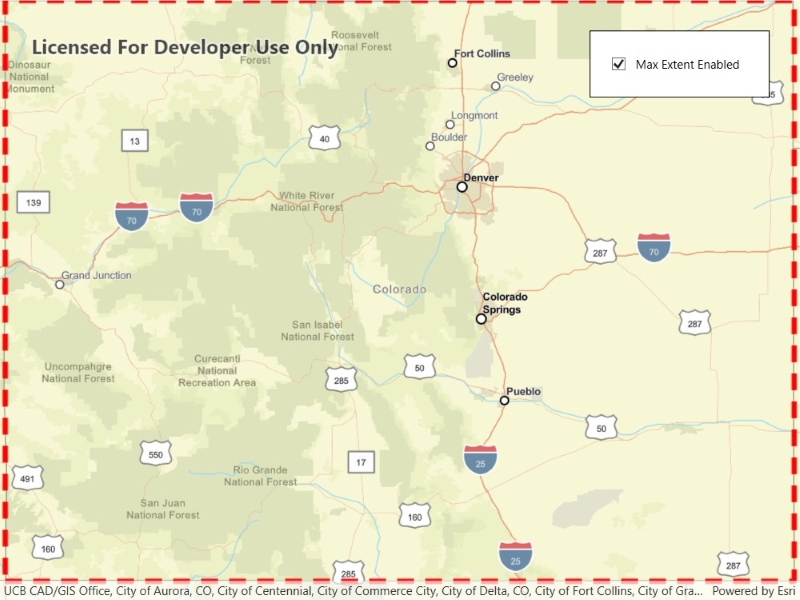

# Set max extent

Limit the view of a map to a particular area.

## Use case

When showing map information relevant to only a certain area, you may wish to constrain the user's ability to pan or zoom away.

## How to use the sample

The application loads with a map whose maximum extent has been set to the borders of Colorado. Note that you won't be able to pan far from the Colorado border or zoom out beyond the minimum scale set by the max extent. Use the control to disable the max extent to freely pan/zoom around the map.

## How it works

1. Create a `Map` object.
2. Create an envelope of the extent.
3. Set the map to a `MapView` object.
4. Set the maximum extent of the map with `map.MaxExtent = extentEnvelope`.
5. Set `MaxExtent` to `null` to disable the maximum extent of the map.

## Relevant API

* Envelope
* Map

## Tags

extent, limit panning, map, mapview, max extent, zoom