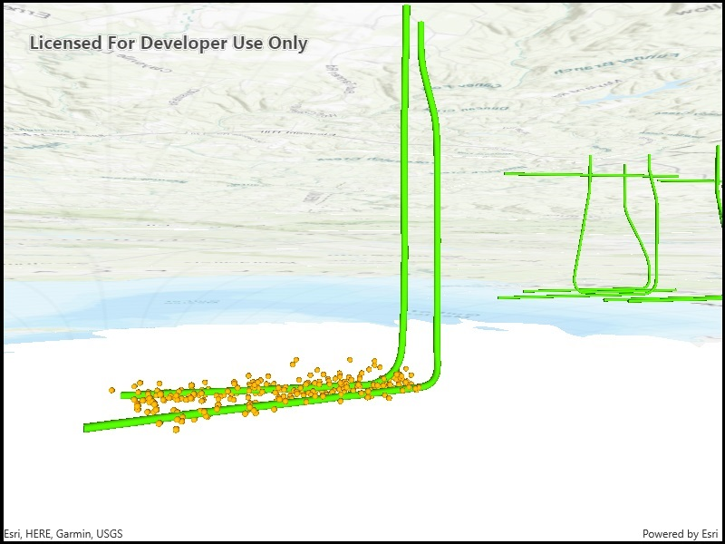

# View content beneath terrain surface

See through terrain in a scene and move the camera underground.

## Use case  

By default, a scene's terrain is fully opaque and the camera cannot go underground. To see underground features such as pipes in a utility network, you can lower the opacity of the terrain surface and set the navigation constraint on the surface to allow underground navigation.

## How it works

Note: This sample uses a web scene, which comes pre-configured with these settings.

1. Display an `Scene` in a `SceneView` which contains layers with underground features.
2. To see underground, get the scene's base surface and set its opacity to a value between 0 and 1.
3. To allow the camera to go underground, set the surface's navigation constraint to `None`.

## Relevant API

* Surface
* Surface.NavigationConstraint

## About the data

This data is a point scene layer showing underground wellbore paths (green polylines) and seismic events (brown points).

## Tags

3D, subsurface, underground, utilities