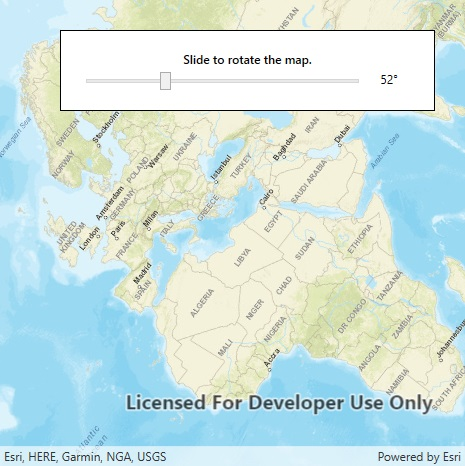

# Map rotation

Rotate a map.

## Use case

A user may wish to view the map in an orientation other than north-facing.

## How it works

1. Instantiate an `Map` object.
2. Display the map in a map view.
3. Use `SetViewpointRotationAsync` to indicate the rotation angle.

## Relevant API

* Map
* Compass
* MapView

## Tags

SetViewpointRotationAsync, rotate
