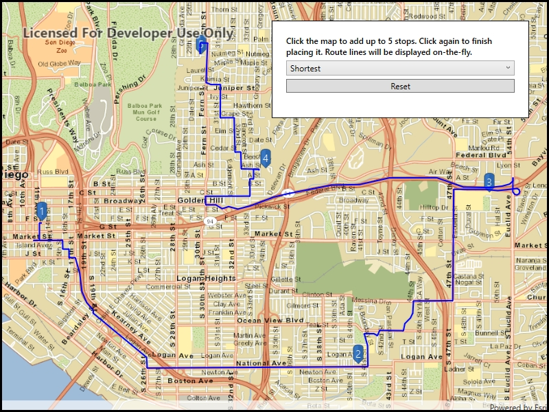

# Offline routing

Solve a route on-the-fly using offline data.

## How to use the sample

Click near a road to start adding a stop to the route, click again to place it on the map. A number graphic will show its order in the route. After adding at least 2 stops, a route will display. Choose "Fastest" or "Shortest" to control how the route is optimized. The route will update on-the-fly while moving stops. The green box marks the boundary of the routable area provided by the offline data. This sample limits routes to 5 stops for performance reasons.

## How it works

1. Create the map's `Basemap` from a local tile package using a `TileCache` and `ArcGISTiledLayer`
2. Create a `RouteTask` with an offline locator geodatabase.
3. Get the `RouteParameters` using `routeTask.CreateDefaultParameters()`
4. Create `Stop`s and add them to the route task's parameters.
5. Solve the `Route` using `routeTask.SolveRouteAsync(routeParameters)`
6. Create a graphic with the route's geometry and a `SimpleLineSymbol` and display it on another `GraphicsOverlay`.

## Offline data

The data used by this sample is available on [ArcGIS Online](https://arcgisruntime.maps.arcgis.com/home/item.html?id=567e14f3420d40c5a206e5c0284cf8fc).

## About the data

This sample uses a pre-packaged sample dataset consisting of a geodatabase with a San Diego road network and a tile package with a streets basemap.

## Relevant API

* RouteParameters
* RouteResult
* RouteTask
* Stop
* TravelMode

## Tags

offline, disconnected, network analysis, routing, fastest, shortest, routing, locator, navigation, connectivity, turn-by-turn
