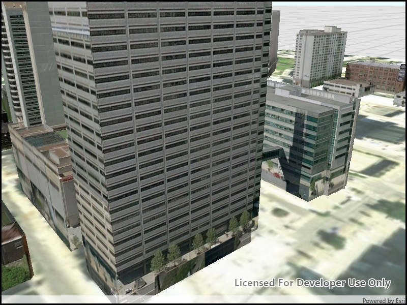

# Open mobile scene package

Opens and displays a scene from a Mobile Scene Package (.mspk).

## Use case

An .mspk file is an archive containing the data (specifically, basemaps and features), used to display an offline 3D scene.

## How to use the sample

When the sample opens, it will automatically display the Scene in the Mobile Map Package.

## How it works

1. Create a `MobileScenePackage` using the path to the local .mspk file.
2. Use `MobileScenePackage.IsDirectReadSupportedAsync` to check whether the package can be read in the archived form (.mspk) or whether it needs to be unpacked.
3. If the mobile scene package requires unpacking, call `MobileScenePackage.UnpackAsync`.
4. Call `MobileScenePackage.Load`.
5. When the `MobileScenePackage` is loaded, obtain the first `Scene` from the `Scenes` property.
6. Display the scene in a SceneView.

## Relevant API

* MobileScenePackage
* SceneView

## Offline data

The following items will be downloaded from ArcGIS Online automatically:

* [Philadelphia MSPK](https://www.arcgis.com/home/item.html?id=7dd2f97bb007466ea939160d0de96a9d) - Philadelphia mobile scene package authored in ArcGIS Pro

## About the data

This mobile scene package was authored with ArcGIS Pro.

## Additional information

An .mspk file is an archive containing the data used to display an offline 3D scene. Some mobile scene packages have data that must be unpacked before reading.

## Tags

offline, scene