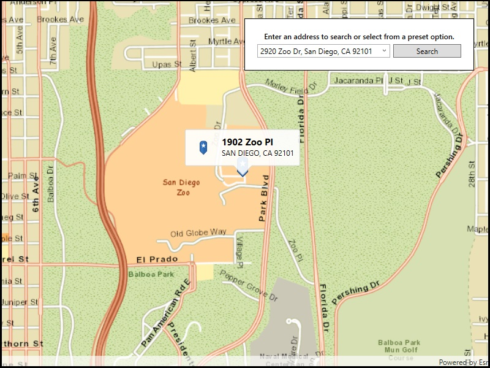

# Offline Geocode

Geocode addresses to locations and reverse geocode locations to addresses when the device does not have network connectivity.

## How to use the sample

Type an address in the search menu option or select from the list to `Geocode` the address and view the result on the map. Tap the location you want to reverse geocode. The locator used by this sample doesn't support suggestion, so you must use a full address (including city) to get results.

## How it works

1. Use the path of SanFrancisco.loc to create a `LocatorTask` object. 
2. Set up `GeocodeParameters` and call `GeocodeAsync` to get geocode results.

## Relevant API

* GeocodeResult
* GeocodeParameters
* LocatorTask
* ReverseGeocodeParameters

## Offline data

The sample viewer will download offline data automatically before loading the sample.
	
* [San Diego Streets Tile Package](http://www.arcgis.com/home/item.html?id=1330ab96ac9c40a49e59650557f2cd63)
* [San Diego Offline Locator](http://www.arcgis.com/home/item.html?id=344e3b12368543ef84045ef9aa3c32ba)
	
## Tags

Search and Query, offline, geocode, locator, geocoder, package